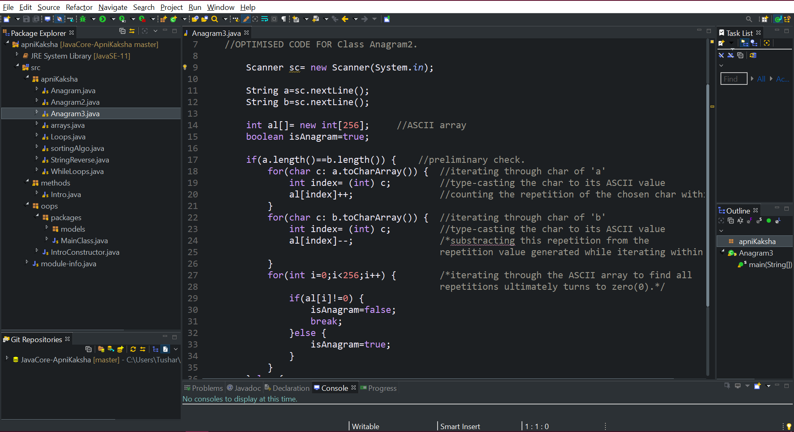

# JavaCore-ApniKaksha
**This repository contains all the code that I practiced while learning Java from the YouTube channel - ApniKaksha.**

*All the contents originally belong to ****Mr.Aman Dhattarwal and Mr.Anuj Kumar Sharma****, the mentors.*

**This repository is a self-tracking log just meant for learning purpose and there are no intentions of plagiarism.**

